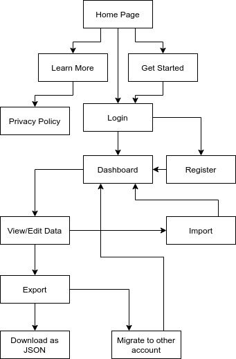

# YouTube Data Migrator

[http://yt-data-migrator.herokuapp.com/](http://yt-data-migrator.herokuapp.com/)  

## How to use this app

First, create an account, this will lead you to the dashboard.

Second, import some data by clicking the import button and following the
instructions on the screen. Currently, attempting this step more than once is
not possible without revoking this app's permissions in the Google security
settings.

Your data should then be visible on the dashboard for you to review.

To download the data, select the items you want in the file, click export, and
select the "DOWNLOAD" option.

To export the data to another account, select the items you want to export,
click export, select the "EXPORT" option, and follow the instructions on the
screen. Currently, attempting this step more than once is not possible without
revoking this app's permissions in the Google security settings.

## Goal

This app aims to migrate data between YouTube accounts conveniently and easily,
by importing and exporting data through the app with the assistance of the
YouTube API.

[Google Identity](https://developers.google.com/identity/sign-in/web/sign-in)  
[YouTube Data API v3](https://developers.google.com/youtube/v3/getting-started)

The interface is intended to be very simple, familiar, and mobile-friendly.
Target users include those who may want to retire an old
Google account, but would encounter difficulty due to needing to transfer
YouTube data to a new account manually.

## Data needs

Frontend needs are handled with JavaScript, JQuery, material design,
and Google Fonts.

Backend needs are handled with Python, PostgreSQL, Flask, and SQLAlchemy.
The API used is the YouTube Data API v3.

Authentication is handled with Google OAuth 2.0.

The YouTube API credentials are obtained for free through the Google Admin
Console.

## Outline

User data that can be migrated at the user's choice only includes the
user's channel subscriptions, liked videos, and any user-created playlists
along with their content.

Unfortunately, the application can not handle saving or migrating the user's
own videos, comments, view history, watch later, added playlists, or other data
not otherwise mentioned.

Login is handled with BCrypt and JWT. Linking YouTube will be handled with the
YouTube Data API. All user data will be deleted automatically after two weeks
for compliance with Google developer policies.

Due to API usage quota, this means that despite importing user YouTube
data uses little quota cost, exporting that data will cost 50 out of the
default 10,000 quota for each resource exported, which means only roughly 190 items
can be migrated per day.

This limitation is of little concern at the moment since this is an
educational/experimental app running off Heroku, however if it appears to be a
success I will consider more appropriate hosting and can make a request to
YouTube for a quota increase accordingly.

The user can save their data to a file, although the exporting of data will
only use the imported data on the server side, rather than exporting from a
user-provided file.

## User Flow

## Database Schema

